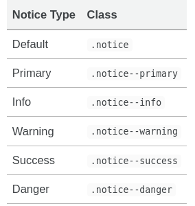

본격적으로 블로그를 활성화하려고 보니 <b>Markdown</b>문법을 하나도 모르는 나를 발견해서  
<span style="color:#819FF7">[공식 사이트](https://mmistakes.github.io/minimal-mistakes/docs/utility-classes/)</span>, <span style="color:#819FF7">[Hyeona님 블로그](https://eona1301.github.io/)</span>, <span style="color:#819FF7">[Danny Kim님 블로그](https://enidanny.github.io/)</span> 등을 참고하여 정리하겠습니다.
<br>


#### 1. 헤더 (Headers)
우측을 보면 우리는 헤더를 통해 목차(table of contents)를 정리할 수 있다.  
일반적으로 H3로 시작해서 H4, H5를 이용하는 것 같다.

```# H1```  
```## H2```  
```### H3```  
```#### H4```  
```##### H5```  
{: .notice--info}


---

#### 2. 글자에 색 넣기
일단, 예제를 보면서 시작해보자. 글자에 색을 넣는 방법은 <span style="color:#819FF7">[HTML컬러차트](https://html-color-codes.info/Korean/)</span>를 참고하려 색을 넣을 수 있다.   
(색 코드: 819FF7, 색 명칭: red)

```<span style="color:#[색 코드]">[작성하는 글]</span>```   
또는  
```<span style="color:[색 명칭]">[작성하는 글]</span>```
{: .notice--info}
---


#### 3. 문자 박스 (Notices)
{: width="30%" height="30%"}  

문자 박스안에 강조하고 싶은 문장이 있을 때 문장에 엔터를 친뒤 {: .notice}를 적용하면 해당 문장이 박스안에 들어간 것을 확인할 수 있다. 

```강조하고 싶은 문장 또는 예시를 작성```  
```{: .notice}```
{: .notice--info}

##### 3.1 문자 박스안에 수식 넣기
간단히 ```를 문장 양옆에 넣은 뒤 {: .notice}를 문단 뒤에 넣으면 된다. 

\`\`\`[수식]\`\`\`   
```{: .notice}```
{: .notice--info}

---

#### 4. 이미지 넣기
바로 위의 문자 박스 이미지를 넣기위해 배워야 했다.
- Markdown 

```{: width="30%" height="30%"}```
{: .notice--info}

- html 

```"```
{: .notice--info}

---

#### 5. 기준선 넣기
각 헤더 사이를 구분하기 위해 보통 넣는 것 같다.

```--- 또는 *** ```
{: .notice--info}

---

#### 6. 주소 링크
아래의 예시를 보면 바로 이해가 될 것이다.  

```[글](주소 링크)``` 또는 ```<주소 링크>```
{: .notice--info}

---

#### 7. 글 정렬
왼쪽 정렬 하고 싶으면 {: .text-left} 문단 뒤 삽입  
비슷하게 {: .text-center}, {: .text-right}등을 활용하면 된다.  

왼쪽 정렬된 글  
```{: .text-left}```
{: .notice--info}

중앙 정렬된 글  
```{: .text-center}```
{: .notice--info}

오른쪽 정렬된 글  
```{: .text-right}```
{: .notice--info}


##### 7.1. 이미지 정렬
아래의 예시 참고.  
비슷하게 {: .align-left}, {: .align-right}, {: .align-center}, {: .align-full} 등을 활용하면 된다.

```{: .align-left}```
{: .notice--info}

---
